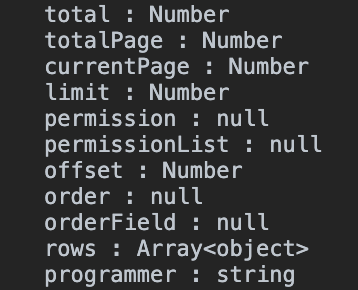

# 返回对象的参数类型

## 说明

### 用于定义对象的 interface 及用于判断后台接口返回的对象类型是否正确

```ts
export const returnInterface = (res: any) => {
  const objArr = Object.keys(res);
  let interfaceStr = "";
  for (let k = 0; k < objArr.length; k++) {
    const thisObj = res[objArr[k]];
    if (thisObj === null) {
      interfaceStr += `${objArr[k]} : null` + "\n";
    } else if (typeof thisObj == "object") {
      if (typeof thisObj.length == "number") {
        interfaceStr += `${objArr[k]} : Array<${typeof thisObj[0]}>` + "\n";
      } else {
        interfaceStr += `${objArr[k]} : object` + "\n";
      }
    } else {
      let typeStr: string = typeof res[objArr[k]];
      typeStr = typeStr.replace(/number/g, "Number");
      interfaceStr += `${objArr[k]} : ${typeStr}` + "\n";
    }
  }
  return interfaceStr;
};
```

## 调用

```ts
this.$util.returnInterface(json);
```

## 返回案例


